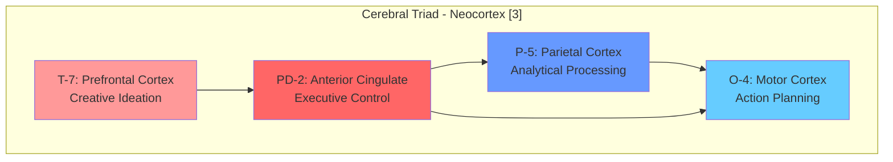
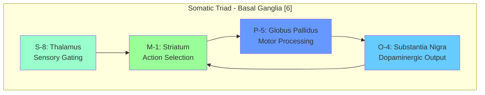
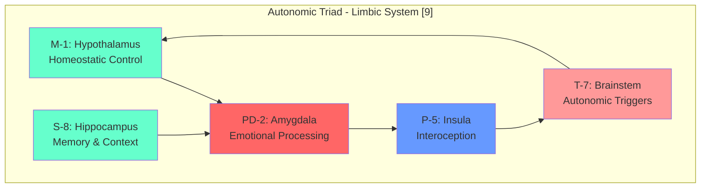

# cosys-xnn Architecture

## Neural Mapping to Cosmos System 5

This document provides comprehensive architectural mapping between the Cosmos System 5 triadic structure and neural/cognitive systems.

---

## Complete Neural-Triad Mapping

### Cerebral Triad → Neocortex Executive Functions



| Service | Neural Region | Brodmann Areas | Function | Neurotransmitter |
|---------|--------------|----------------|----------|------------------|
| T-7 | Right Prefrontal | BA 9, 10, 46 | Creative ideation, divergent thinking | Dopamine, Norepinephrine |
| PD-2 | Anterior Cingulate | BA 24, 32, 33 | Conflict monitoring, attention control | Glutamate, GABA |
| P-5 | Parietal Cortex | BA 5, 7, 39, 40 | Spatial reasoning, mathematical processing | Glutamate |
| O-4 | Motor Cortex | BA 4, 6 | Motor planning, action sequencing | Glutamate, Acetylcholine |

### Somatic Triad → Basal Ganglia Motor Control



| Service | Neural Region | Subdivisions | Function | Neurotransmitter |
|---------|--------------|--------------|----------|------------------|
| M-1 | Striatum | Caudate, Putamen | Action selection, habit formation | GABA, Dopamine receptors |
| S-8 | Thalamus | VL, VA, MD nuclei | Sensory relay, motor gating | Glutamate |
| P-5 | Globus Pallidus | GPi, GPe | Motor inhibition/disinhibition | GABA |
| O-4 | Substantia Nigra | SNc, SNr | Dopaminergic modulation | Dopamine |

### Autonomic Triad → Limbic System Regulation



| Service | Neural Region | Subdivisions | Function | Neurotransmitter |
|---------|--------------|--------------|----------|------------------|
| M-1 | Hypothalamus | PVN, LH, VMH | Homeostasis, autonomic control | Multiple peptides |
| S-8 | Hippocampus | CA1, CA3, DG | Episodic memory, spatial context | Glutamate, Acetylcholine |
| PD-2 | Amygdala | BLA, CeA | Fear conditioning, emotional valence | GABA, Glutamate |
| P-5 | Insula | Anterior, Posterior | Interoception, emotional awareness | Glutamate |
| T-7 | Brainstem | PAG, LC, NTS | Autonomic reflexes, arousal | Norepinephrine, Serotonin |

---

## Dimensional Flow Neural Pathways

### Commitment Dimension [5-4]: Dorsal Stream

**Neural Pathway**: Posterior Parietal → Premotor → Motor Cortex

```
Parietal Cortex (P-5) → Premotor Cortex → Primary Motor (O-4)
     │                        │                    │
     ▼                        ▼                    ▼
 Spatial Analysis      Action Planning      Motor Execution
```

**Characteristics**:
- "Where/How" pathway for action
- Visuomotor transformation
- Online motor control
- Commitment to action

### Potential Dimension [2-7]: Prefrontal-Limbic Circuit

**Neural Pathway**: Anterior Cingulate ↔ Prefrontal Cortex ↔ Hippocampus

```
ACC (PD-2) ←→ Prefrontal (T-7) ←→ Hippocampus
    │              │                    │
    ▼              ▼                    ▼
 Conflict      Creative            Memory
 Detection     Ideation            Retrieval
```

**Characteristics**:
- Executive control network
- Creative potential generation
- Memory-guided planning
- Cognitive flexibility

### Performance Dimension [8-1]: Thalamo-Cortical Loop

**Neural Pathway**: Thalamus → Cortex → Basal Ganglia → Thalamus

```
Thalamus (S-8) → Cortex → Striatum (M-1) → Pallidum → Thalamus
      │            │           │              │
      ▼            ▼           ▼              ▼
   Gating      Processing   Selection    Inhibition
```

**Characteristics**:
- Cortico-basal ganglia-thalamo-cortical loop
- Action selection and gating
- Performance optimization
- Habit formation

---

## System 5 Neural State Machine

### 60-Step Cycle Implementation

```python
class NeuralSystem5StateMachine:
    """
    Implements the 60-step deterministic cycle for neural processing.
    LCM(3, 20) = 60 steps for full Universal-Particular synchronization.
    """
    
    def __init__(self):
        # Universal Sets: Global Workspace States
        self.U1 = GlobalWorkspaceState()  # Primary attention
        self.U2 = SalienceNetworkState()  # Secondary filtering
        self.U3 = DefaultModeState()      # Tertiary integration
        
        # Particular Sets: Processing Regions
        self.P1 = SensoryProcessingState()    # Input
        self.P2 = AssociationProcessingState() # Integration
        self.P3 = PrefrontalProcessingState()  # Planning
        self.P4 = MotorProcessingState()       # Output
        
    def step(self, t: int):
        """Execute one step of the 60-step cycle."""
        # Universal transition (3-step cycle)
        u_idx = t % 3
        self.transition_universal(u_idx)
        
        # Particular transition (5-step staggered, 20-step cycle)
        p_idx = t % 5
        if p_idx < 4:  # Not rest step
            self.transition_particular(p_idx, u_idx)
            
    def transition_particular(self, p_idx: int, u_idx: int):
        """
        Nested concurrency transition:
        S_i(t+1) = (S_i(t) + Σ S_j(t) + U_idx(t)) mod 4
        """
        active_set = [self.P1, self.P2, self.P3, self.P4][p_idx]
        other_sets = [s for i, s in enumerate([self.P1, self.P2, self.P3, self.P4]) 
                      if i != p_idx]
        
        convolution_sum = sum(s.state for s in other_sets)
        active_set.state = (active_set.state + convolution_sum + u_idx) % 4
```

### Neural Correlates of State Transitions

| Step Type | Neural Event | Timescale | Correlate |
|-----------|-------------|-----------|-----------|
| U1 → U2 | Global → Salience | ~100ms | P300, attention shift |
| U2 → U3 | Salience → DMN | ~200ms | Mind-wandering onset |
| U3 → U1 | DMN → Global | ~150ms | Task re-engagement |
| P1 → P2 | Sensory → Association | ~50ms | N1/P1 complex |
| P2 → P3 | Association → Prefrontal | ~100ms | P2/N2 complex |
| P3 → P4 | Prefrontal → Motor | ~150ms | Readiness potential |

---

## Polarity-Based Neural Dynamics

### Sympathetic Polarity → Excitatory Networks

**Neural Implementation**: Glutamatergic excitation, noradrenergic arousal

| Triad | Service | Neural Substrate | Activation Pattern |
|-------|---------|-----------------|-------------------|
| Cerebral | T-7 | Right PFC | High-frequency gamma |
| Somatic | M-1 | Striatum | Beta desynchronization |
| Autonomic | T-7 | Brainstem | Sympathetic activation |

### Parasympathetic Polarity → Inhibitory Networks

**Neural Implementation**: GABAergic inhibition, cholinergic modulation

| Triad | Service | Neural Substrate | Activation Pattern |
|-------|---------|-----------------|-------------------|
| Cerebral | PD-2 | ACC | Theta synchronization |
| Shared | M-1, S-8, PD-2 | Limbic | Alpha synchronization |

### Somatic Polarity → Motor Networks

**Neural Implementation**: Motor cortex activation, cerebellar coordination

| Triad | Service | Neural Substrate | Activation Pattern |
|-------|---------|-----------------|-------------------|
| Cerebral | P-5, O-4 | Parietal-Motor | Mu suppression |
| Somatic | S-8, P-5 | Thalamo-cortical | Beta oscillations |
| Autonomic | P-5 | Insula | Interoceptive alpha |

---

## Integration Mechanisms

### Global Workspace Theory Implementation

```python
class GlobalWorkspace:
    """
    Implements Dehaene's Global Workspace Theory as the integration hub.
    """
    
    def __init__(self):
        self.workspace_neurons = PrefrontalWorkspace()
        self.ignition_threshold = 0.7
        self.broadcast_connections = AllToAllConnections()
        
    def compete_for_access(self, representations: List[Representation]):
        """
        Representations compete for conscious access through
        winner-take-all dynamics in the global workspace.
        """
        # Bottom-up salience
        salience_scores = [self.compute_salience(r) for r in representations]
        
        # Top-down attention
        attention_weights = self.attention_controller.get_weights()
        
        # Combined activation
        activations = [s * a for s, a in zip(salience_scores, attention_weights)]
        
        # Winner-take-all selection
        winner_idx = np.argmax(activations)
        
        if activations[winner_idx] > self.ignition_threshold:
            return self.broadcast(representations[winner_idx])
        return None
        
    def broadcast(self, representation: Representation):
        """
        Broadcast winning representation to all connected modules.
        This implements the "ignition" of conscious access.
        """
        for connection in self.broadcast_connections:
            connection.send(representation)
        return BroadcastEvent(representation, timestamp=now())
```

### Predictive Processing Framework

```python
class PredictiveProcessingHierarchy:
    """
    Implements predictive coding across the neural hierarchy.
    """
    
    def __init__(self, levels: int = 6):
        self.levels = [PredictiveLevel(i) for i in range(levels)]
        
    def process(self, sensory_input: np.ndarray):
        """
        Bottom-up prediction errors meet top-down predictions.
        """
        # Bottom-up pass: compute prediction errors
        prediction_errors = []
        current_input = sensory_input
        
        for level in self.levels:
            prediction = level.generate_prediction()
            error = current_input - prediction
            prediction_errors.append(error)
            current_input = level.encode(error)
            
        # Top-down pass: update predictions
        for i in reversed(range(len(self.levels) - 1)):
            self.levels[i].update_prediction(
                self.levels[i + 1].get_state(),
                prediction_errors[i]
            )
            
        return PredictiveState(
            predictions=[l.prediction for l in self.levels],
            errors=prediction_errors
        )
```

---

## Cognitive Process Flows

### Perception-Action Cycle

```
Sensory Input → Thalamus (S-8) → Sensory Cortex (P1)
                     │
                     ▼
            Association Cortex (P2) ← Hippocampus (S-8)
                     │
                     ▼
            Prefrontal Cortex (P3) ← ACC (PD-2)
                     │
                     ▼
            Motor Cortex (P4) → Basal Ganglia (M-1)
                     │
                     ▼
               Motor Output
```

### Emotional Processing Flow

```
Stimulus → Thalamus → Amygdala (PD-2) → Hypothalamus (M-1)
               │            │                   │
               ▼            ▼                   ▼
         Quick Route   Slow Route        Autonomic Response
               │            │                   │
               └────────────┼───────────────────┘
                            ▼
                    Insula (P-5) → Conscious Feeling
```

### Memory Consolidation Flow

```
Experience → Hippocampus (S-8) → Neocortex (distributed)
                  │
                  ▼ (sleep)
         Replay & Consolidation
                  │
                  ▼
         Long-term Memory Storage
```

---

## Network Dynamics

### Default Mode Network (DMN)

**Components**: mPFC, PCC, Angular Gyrus, Hippocampus

**Cosmos Mapping**: U3 (Tertiary Universal), S-8 (State Management)

**Function**: Self-referential processing, autobiographical memory, future simulation

### Salience Network (SN)

**Components**: Anterior Insula, dACC

**Cosmos Mapping**: U2 (Secondary Universal), P-5 (Insula), PD-2 (ACC)

**Function**: Detecting relevant stimuli, switching between networks

### Central Executive Network (CEN)

**Components**: dlPFC, Posterior Parietal

**Cosmos Mapping**: U1 (Primary Universal), T-7, P-5 (Parietal)

**Function**: Working memory, cognitive control, goal-directed behavior

### Network Switching Dynamics

```python
class TripleNetworkModel:
    """
    Implements the triple network model of brain function.
    """
    
    def __init__(self):
        self.dmn = DefaultModeNetwork()
        self.sn = SalienceNetwork()
        self.cen = CentralExecutiveNetwork()
        
    def switch_networks(self, salience_signal: float):
        """
        Salience network mediates switching between DMN and CEN.
        """
        if salience_signal > self.switch_threshold:
            # External salience: activate CEN, suppress DMN
            self.cen.activate()
            self.dmn.suppress()
        else:
            # Low salience: activate DMN, suppress CEN
            self.dmn.activate()
            self.cen.suppress()
            
        # Salience network always monitors
        self.sn.monitor()
```

---

## Oscillatory Dynamics

### Frequency Band Mapping

| Band | Frequency | Cosmos Component | Function |
|------|-----------|-----------------|----------|
| Delta | 0.5-4 Hz | Deep autonomic | Sleep, regeneration |
| Theta | 4-8 Hz | Hippocampal (S-8) | Memory encoding |
| Alpha | 8-12 Hz | Thalamic (S-8) | Inhibition, gating |
| Beta | 12-30 Hz | Motor (M-1, O-4) | Motor control |
| Gamma | 30-100 Hz | Cortical (T-7, P-5) | Binding, attention |

### Cross-Frequency Coupling

```python
class CrossFrequencyCoupling:
    """
    Implements phase-amplitude coupling between frequency bands.
    """
    
    def compute_pac(self, low_freq_phase: np.ndarray, 
                    high_freq_amplitude: np.ndarray) -> float:
        """
        Phase-amplitude coupling: theta phase modulates gamma amplitude.
        This implements hierarchical information flow.
        """
        # Extract phase of low frequency
        phase = np.angle(hilbert(low_freq_phase))
        
        # Extract amplitude of high frequency
        amplitude = np.abs(hilbert(high_freq_amplitude))
        
        # Compute modulation index
        return self.modulation_index(phase, amplitude)
```

---

## Implementation Guidelines

### Service Communication

All inter-triad communication follows neural pathway constraints:

1. **Cerebral ↔ Somatic**: Cortico-striatal projections
2. **Somatic ↔ Autonomic**: Basal ganglia-limbic connections
3. **Autonomic ↔ Cerebral**: Limbic-prefrontal pathways

### Timing Constraints

Neural processing respects biological timing:

- **Synaptic transmission**: 1-5 ms
- **Local processing**: 10-50 ms
- **Inter-regional**: 50-200 ms
- **Global integration**: 200-500 ms

### Plasticity Rules

Learning follows Hebbian and anti-Hebbian principles:

```python
def hebbian_update(pre: float, post: float, learning_rate: float = 0.01):
    """Neurons that fire together, wire together."""
    return learning_rate * pre * post

def stdp_update(pre_time: float, post_time: float, 
                a_plus: float = 0.01, a_minus: float = 0.012,
                tau_plus: float = 20, tau_minus: float = 20):
    """Spike-timing dependent plasticity."""
    dt = post_time - pre_time
    if dt > 0:
        return a_plus * np.exp(-dt / tau_plus)
    else:
        return -a_minus * np.exp(dt / tau_minus)
```

---

## References

- Dehaene, S., & Changeux, J. P. (2011). Experimental and theoretical approaches to conscious processing.
- Friston, K. (2010). The free-energy principle: a unified brain theory?
- Menon, V. (2011). Large-scale brain networks and psychopathology.
- Buzsáki, G. (2006). Rhythms of the Brain.
