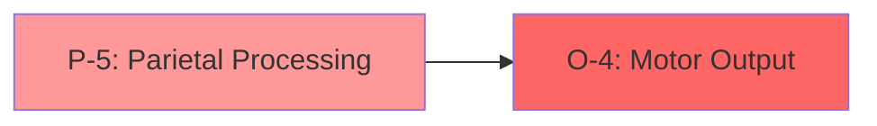
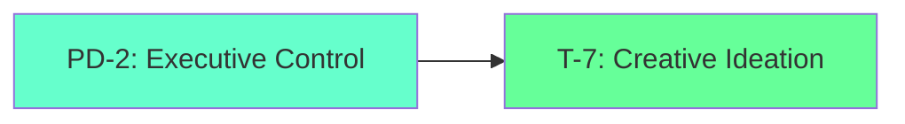

# cosys-xnn

## Cosmos System Model Applied to Cognitive Function, Brain Regions & Neural Networks

This repository implements the **Cosmos System 5** triadic architecture mapped to the neurological and cognitive domains, providing a comprehensive framework for understanding and modeling brain function, neural networks, and cognitive processes through the lens of organizational systems theory.

---

## Overview

**cosys-xnn** translates the Cosmos System's triadic polarity structure into a neurologically-accurate model of cognitive function. The system implements the **18-service [[D-T]-[P-O]-[S-M]] pattern** mapped to brain regions, neural pathways, and cognitive processes.

### Core Mapping: Brain as Cognitive Triad

```
┌─────────────────────────────────────────────────────────────────────────────┐
│                    COSYS-XNN: NEURAL COSMOS SYSTEM                          │
├─────────────────────────────────────────────────────────────────────────────┤
│                                                                             │
│   ┌─────────────────────────────────────────────────────────────────────┐   │
│   │                    CEREBRAL TRIAD [3]                               │   │
│   │                    Neocortex - Executive Functions                  │   │
│   │                    Potential Topology                               │   │
│   ├─────────────────────────────────────────────────────────────────────┤   │
│   │  T-7: Prefrontal Cortex    │  PD-2: Anterior Cingulate            │   │
│   │  Creative Ideation         │  Executive Coordination               │   │
│   │  Right Hemisphere          │  Attention Control                    │   │
│   ├────────────────────────────┼────────────────────────────────────────┤   │
│   │  P-5: Parietal Cortex      │  O-4: Motor Cortex                   │   │
│   │  Analytical Processing     │  Action Planning & Output             │   │
│   │  Spatial Reasoning         │  Left Hemisphere                      │   │
│   └─────────────────────────────────────────────────────────────────────┘   │
│                                    │                                        │
│                                    ▼                                        │
│   ┌─────────────────────────────────────────────────────────────────────┐   │
│   │                    SOMATIC TRIAD [6]                                │   │
│   │                    Basal Ganglia - Motor Control                    │   │
│   │                    Commitment Topology                              │   │
│   ├─────────────────────────────────────────────────────────────────────┤   │
│   │  M-1: Striatum             │  S-8: Thalamus                        │   │
│   │  Motor Initiation          │  Sensory Relay                        │   │
│   │  Action Selection          │  Gating Function                      │   │
│   ├────────────────────────────┼────────────────────────────────────────┤   │
│   │  P-5: Globus Pallidus      │  O-4: Substantia Nigra               │   │
│   │  Motor Processing          │  Dopaminergic Output                  │   │
│   │  Behavioral Techniques     │  Reward Signaling                     │   │
│   └─────────────────────────────────────────────────────────────────────┘   │
│                                    │                                        │
│                                    ▼                                        │
│   ┌─────────────────────────────────────────────────────────────────────┐   │
│   │                    AUTONOMIC TRIAD [9]                              │   │
│   │                    Limbic System - Emotional Regulation             │   │
│   │                    Performance Topology                             │   │
│   ├─────────────────────────────────────────────────────────────────────┤   │
│   │  M-1: Hypothalamus         │  S-8: Hippocampus                     │   │
│   │  Homeostatic Monitoring    │  Memory & State Management            │   │
│   │  Autonomic Control         │  Contextual Processing                │   │
│   ├────────────────────────────┼────────────────────────────────────────┤   │
│   │  PD-2: Amygdala            │  T-7: Brainstem                       │   │
│   │  Emotional Processing      │  Autonomic Triggers                   │   │
│   │  Fear/Reward Circuits      │  Reflex Responses                     │   │
│   ├────────────────────────────┼────────────────────────────────────────┤   │
│   │  P-5: Insula               │                                       │   │
│   │  Interoceptive Processing  │                                       │   │
│   │  Emotional Awareness       │                                       │   │
│   └─────────────────────────────────────────────────────────────────────┘   │
│                                                                             │
└─────────────────────────────────────────────────────────────────────────────┘
```

---

## Theoretical Foundation

### The Ennead Meta-System (9-Fold Structure)

Based on Eric Schwarz's Holistic Metamodel and John Vervaeke's Relevance Realization framework, cosys-xnn implements a **triad-of-triads** cognitive architecture:

#### Triad I: Ways of Knowing (Epistemological)
| Component | Neural Substrate | Function |
|-----------|-----------------|----------|
| **Propositional** | Left Prefrontal Cortex | Facts, beliefs, declarative knowledge |
| **Procedural** | Basal Ganglia, Cerebellum | Skills, motor programs, implicit knowledge |
| **Perspectival** | Parietal Cortex, TPJ | Salience, framing, attention |
| **Participatory** | Default Mode Network | Identity, self-model, being |

#### Triad II: Orders of Understanding (Ontological)
| Order | Neural Network | Function |
|-------|---------------|----------|
| **Nomological** | Dorsolateral PFC | Causal reasoning, scientific understanding |
| **Normative** | Ventromedial PFC | Value judgments, ethical reasoning |
| **Narrative** | Temporal Cortex, Hippocampus | Story construction, temporal coherence |

#### Triad III: Practices of Wisdom (Axiological)
| Practice | Neural Circuit | Function |
|----------|---------------|----------|
| **Morality** | Orbitofrontal Cortex | Virtue, ethical behavior |
| **Meaning** | Default Mode + Salience Networks | Coherence, purpose |
| **Mastery** | Motor + Cerebellar Circuits | Excellence, flow states |

---

## System 5 State Transition Model

The neural implementation follows the **60-step deterministic cycle** with 7 sets operating on nested concurrency:

### Universal Sets (U1, U2, U3) - 3-Step Cycle
```
U1 → U2 → U3 → U1 (Primary → Secondary → Tertiary)
```

| Set | Neural Correlate | Function |
|-----|-----------------|----------|
| **U1** | Global Workspace | Primary attention, conscious access |
| **U2** | Salience Network | Secondary filtering, relevance |
| **U3** | Default Mode | Tertiary integration, self-reference |

### Particular Sets (P1, P2, P3, P4) - 20-Step Staggered Cycle
```
P1(t≡0) → P2(t≡1) → P3(t≡2) → P4(t≡3) → rest(t≡4)
```

| Set | Neural Correlate | Function |
|-----|-----------------|----------|
| **P1** | Sensory Cortices | Input processing |
| **P2** | Association Cortices | Integration |
| **P3** | Prefrontal Cortex | Planning |
| **P4** | Motor Cortices | Output execution |

### Nested Concurrency Transition Function

$$S_{i}(t+1) = (S_{i}(t) + \sum_{j \neq i} S_{j}(t) + U_{idx}(t)) \mod 4$$

This implements the **convolution of concurrency** where each neural region's state depends on all other regions plus the global workspace phase.

---

## Polarity-Based Neural Architecture

### The 18-Service [[D-T]-[P-O]-[S-M]] Pattern

Each triad implements 6 services following the dimensional flow pattern:

#### Cerebral Triad Services
| Service | Code | Brain Region | Function |
|---------|------|--------------|----------|
| Development | PD-2 | Anterior Cingulate | Executive coordination |
| Treasury | T-7 | Right Prefrontal | Creative ideation |
| Production | P-5 | Parietal Cortex | Analytical processing |
| Organization | O-4 | Motor Cortex | Action planning |
| Sales | S-8 | Temporal Cortex | Output promotion |
| Market | M-1 | Sensory Cortex | Environmental interface |

#### Somatic Triad Services
| Service | Code | Brain Region | Function |
|---------|------|--------------|----------|
| Development | PD-2 | Caudate Nucleus | Motor development |
| Treasury | T-7 | Putamen | Motor memory |
| Production | P-5 | Globus Pallidus | Behavioral processing |
| Organization | O-4 | Substantia Nigra | Motor output |
| Sales | S-8 | Thalamus | Sensory relay |
| Market | M-1 | Striatum | Action selection |

#### Autonomic Triad Services
| Service | Code | Brain Region | Function |
|---------|------|--------------|----------|
| Development | PD-2 | Amygdala | Emotional processing |
| Treasury | T-7 | Brainstem | Reflex memory |
| Production | P-5 | Insula | Interoceptive processing |
| Organization | O-4 | Cingulate | Autonomic organization |
| Sales | S-8 | Hippocampus | State management |
| Market | M-1 | Hypothalamus | Homeostatic monitoring |

---

## Dimensional Flow Architecture

### Commitment Dimension [5-4]: Production → Organization
**Neural Flow**: Processing → Action Output



### Potential Dimension [2-7]: Development → Treasury
**Neural Flow**: Coordination → Creative Memory



### Performance Dimension [8-1]: Sales → Market
**Neural Flow**: Sensory Processing → Environmental Interface


---

## Autognosis: Neural Self-Awareness

The system implements **hierarchical self-image building** through recursive meta-cognitive monitoring:

### Self-Monitoring Layer
- Continuous observation of neural states
- Pattern detection in activation dynamics
- Anomaly identification in network behavior

### Self-Modeling Layer
- Hierarchical self-image at multiple cognitive levels
- Recursive modeling (meta-cognition about meta-cognition)
- Confidence scoring for self-understanding

### Meta-Cognitive Layer
- Higher-order reasoning about reasoning
- Insight generation from self-analysis
- Self-awareness assessment

### Self-Optimization Layer
- Optimization opportunity discovery
- Adaptive improvements based on self-insights
- Relevance realization optimization

---

## Ontogenesis: Self-Generating Neural Kernels

The neural architecture supports **self-generating, evolving kernels** through recursive application of differential operators:

### Kernel Genome (Neural DNA)
```typescript
interface NeuralKernelGenome {
  id: string;                     // Unique neural pattern identifier
  generation: number;             // Learning iteration
  lineage: string[];              // Parent pattern IDs
  genes: NeuralGene[];            // Synaptic weight patterns
  fitness: number;                // Performance metric
  age: number;                    // Consolidation cycles
}
```

### Development Stages
1. **Embryonic**: Initial random connectivity
2. **Juvenile**: Hebbian learning, pruning
3. **Mature**: Stable, optimized patterns
4. **Senescent**: Declining plasticity

### B-Series Neural Expansion
```
y_{n+1} = y_n + h * Σ b_i * Φ_i(f, y_n)
```
Where elementary differentials (A000081 sequence) represent neural computation trees.

---

## Implementation

### Directory Structure
```
cosys-xnn/
├── README.md
├── ARCHITECTURE.md
├── NEURAL_MAPPING.md
├── src/
│   ├── cerebral-triad/
│   │   ├── thought-service/          # T-7: Prefrontal processing
│   │   ├── processing-director/      # PD-2: Executive control
│   │   ├── processing-service/       # P-5: Analytical processing
│   │   └── output-service/           # O-4: Motor planning
│   ├── somatic-triad/
│   │   ├── motor-control-service/    # M-1: Striatum
│   │   ├── sensory-service/          # S-8: Thalamus
│   │   ├── processing-service/       # P-5: Basal ganglia
│   │   └── output-service/           # O-4: Motor output
│   ├── autonomic-triad/
│   │   ├── monitoring-service/       # M-1: Hypothalamus
│   │   ├── state-management/         # S-8: Hippocampus
│   │   ├── process-director/         # PD-2: Amygdala
│   │   ├── processing-service/       # P-5: Insula
│   │   └── trigger-service/          # T-7: Brainstem
│   ├── cognitive-core/
│   │   ├── relevance-realization/    # Salience computation
│   │   ├── autognosis/               # Self-awareness system
│   │   ├── ontogenesis/              # Self-generating kernels
│   │   └── holistic-metamodel/       # Ennead integration
│   └── integration-hub/
│       ├── global-workspace/         # Conscious access
│       ├── event-bus/                # Neural pathways
│       └── shared-libraries/         # Common utilities
├── models/
│   ├── system5-neural.py             # 60-step state machine
│   ├── ennead-cognitive.py           # 9-fold meta-system
│   └── polarity-neural.py            # 18-service mapping
└── docs/
    ├── cognitive-science.md
    ├── neural-correlates.md
    └── implementation-guide.md
```

### Core Services

#### Cerebral Triad: Executive Functions
```typescript
// thought-service (T-7) - Creative Ideation
interface ThoughtService {
  generateIdeas(context: CognitiveContext): Promise<Idea[]>;
  patternRecognition(input: SensoryData): Promise<Pattern[]>;
  creativeAssociation(concepts: Concept[]): Promise<Association[]>;
}

// processing-director (PD-2) - Executive Coordination
interface ProcessingDirector {
  coordinateAttention(targets: AttentionTarget[]): Promise<void>;
  allocateResources(demands: ResourceDemand[]): Promise<Allocation>;
  resolveConflicts(conflicts: CognitiveConflict[]): Promise<Resolution>;
}
```

#### Somatic Triad: Motor Control
```typescript
// motor-control-service (M-1) - Action Selection
interface MotorControlService {
  selectAction(options: ActionOption[]): Promise<SelectedAction>;
  sequenceMovements(goal: MotorGoal): Promise<MovementSequence>;
  coordinateExecution(plan: MotorPlan): Promise<ExecutionResult>;
}

// sensory-service (S-8) - Sensory Relay
interface SensoryService {
  processInput(sensory: SensoryInput): Promise<ProcessedSensory>;
  gateInformation(stream: SensoryStream): Promise<GatedStream>;
  integrateModalities(inputs: MultimodalInput[]): Promise<IntegratedPercept>;
}
```

#### Autonomic Triad: Emotional Regulation
```typescript
// state-management (S-8) - Memory & Context
interface StateManagementService {
  encodeMemory(experience: Experience): Promise<EncodedMemory>;
  retrieveContext(cue: RetrievalCue): Promise<Context>;
  updateState(delta: StateDelta): Promise<UpdatedState>;
}

// trigger-service (T-7) - Autonomic Responses
interface TriggerService {
  detectThreat(input: SensoryInput): Promise<ThreatAssessment>;
  initiateResponse(threat: Threat): Promise<AutonomicResponse>;
  modulateArousal(level: ArousalLevel): Promise<void>;
}
```

---

## Relevance Realization Engine

The core cognitive process implementing Vervaeke's framework:

```python
class RelevanceRealizationEngine:
    """
    Implements the dynamic, self-organizing process of relevance realization
    through continuous balancing of cognitive tradeoffs.
    """
    
    def __init__(self):
        self.salience_landscape = SalienceLandscape()
        self.affordance_space = AffordanceSpace()
        self.attention_controller = AttentionController()
        
    def realize_relevance(self, context: CognitiveContext) -> RelevanceMap:
        """
        Core relevance realization loop implementing:
        - Filtering: Reduce complexity to manageable scope
        - Framing: Structure attention to foreground salient patterns
        - Feed Forward: Use current relevance to anticipate future
        - Feed Back: Update relevance criteria based on outcomes
        """
        # Balance exploration vs exploitation
        exploration_weight = self.compute_exploration_weight(context)
        
        # Generate salience landscape
        salience = self.salience_landscape.compute(context)
        
        # Identify affordances
        affordances = self.affordance_space.detect(context, salience)
        
        # Allocate attention
        attention = self.attention_controller.allocate(
            salience, affordances, exploration_weight
        )
        
        return RelevanceMap(
            salience=salience,
            affordances=affordances,
            attention=attention,
            tradeoffs=self.current_tradeoffs
        )
    
    @property
    def current_tradeoffs(self) -> CognitiveTradeoffs:
        """
        Continuous balancing of:
        - Exploration vs Exploitation
        - Breadth vs Depth
        - Stability vs Flexibility
        - Speed vs Accuracy
        - Certainty vs Openness
        """
        return CognitiveTradeoffs(
            exploration_exploitation=self.exploration_weight,
            breadth_depth=self.search_strategy,
            stability_flexibility=self.adaptation_rate,
            speed_accuracy=self.processing_mode,
            certainty_openness=self.confidence_threshold
        )
```

---

## 4E Cognition Implementation

### Embodied Cognition
- Sensorimotor grounding through somatic triad
- Body-state integration via interoceptive processing
- Action-perception coupling

### Embedded Cognition
- Environmental context through sensory services
- Affordance detection in motor control
- Niche construction through behavioral output

### Enacted Cognition
- World co-creation through motor execution
- Active sampling via attention control
- Participatory engagement through autonomic regulation

### Extended Cognition
- Tool integration through external interfaces
- Cultural scaffolding via memory systems
- Distributed processing across network

---

## Usage

### Basic Initialization
```python
from cosys_xnn import NeuralCosmosSystem

# Initialize the neural cosmos system
system = NeuralCosmosSystem()
await system.initialize()

# Run cognitive cycle
result = await system.process_cycle(
    sensory_input=sensory_data,
    context=cognitive_context
)

# Access triad states
cerebral_state = system.cerebral_triad.get_state()
somatic_state = system.somatic_triad.get_state()
autonomic_state = system.autonomic_triad.get_state()
```

### Relevance Realization
```python
from cosys_xnn.cognitive_core import RelevanceRealizationEngine

# Initialize relevance engine
rr_engine = RelevanceRealizationEngine()

# Realize relevance for current context
relevance_map = rr_engine.realize_relevance(context)

# Access salience landscape
salient_features = relevance_map.salience.top_features(k=10)

# Detect affordances
available_actions = relevance_map.affordances.get_actions()
```

### Autognosis Cycle
```python
from cosys_xnn.cognitive_core import AutognosisOrchestrator

# Initialize autognosis
autognosis = AutognosisOrchestrator()

# Run self-awareness cycle
cycle_results = await autognosis.run_autognosis_cycle(system)

# Access self-images
self_images = autognosis.current_self_images
meta_insights = cycle_results['insights']
```

---

## References

- Schwarz, E. (1997). Toward a Holistic Cybernetics: From Science through Epistemology to Being
- Vervaeke, J. (2019). Awakening from the Meaning Crisis (Lecture Series)
- Butcher, J.C. (2016). Numerical Methods for Ordinary Differential Equations
- Dehaene, S. (2014). Consciousness and the Brain
- Friston, K. (2010). The Free-Energy Principle: A Unified Brain Theory?

---

## License

MIT License - See [LICENSE](LICENSE) for details.

---

**cosys-xnn**: Where the Cosmos System meets cognitive neuroscience, creating a unified framework for understanding mind, brain, and neural computation through triadic organizational dynamics.
